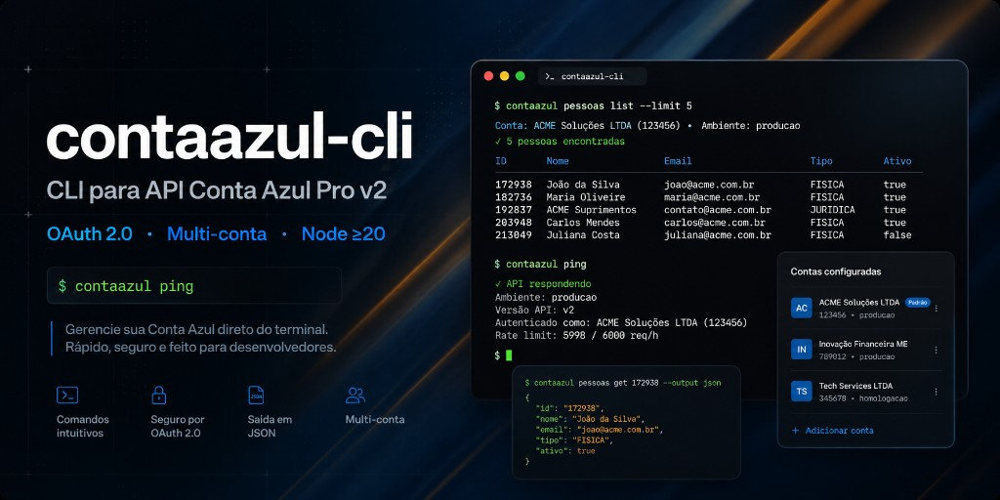

# CONTAZUL-CLI

<div align="center">
  
</div>

CLI profissional para a **API pública Conta Azul Pro (ERP v2)**. Autenticação OAuth 2.0, multi-conta, detecção de ambiente dev/prod e CRUD completo sobre os recursos da API.

Recursos em **português** (como as rotas oficiais) · ações e flags em **inglês** (padrão de CLIs como `git`, `npm`, `bun`).

> **Escopo:** este pacote cobre **Conta Azul Pro** via API v2. Não inclui Conta Azul Mais (sem API pública própria).

---

## Pacote npm

| Pacote | Descrição |
|--------|-----------|
| [`contaazul-cli`](https://www.npmjs.com/package/contaazul-cli) | Binário `contaazul` + exports programáticos opcionais |

**Requisitos:** Node.js **≥ 20**

---

## Instalação

**Global (recomendado):**

```bash
npm install -g contaazul-cli
```

**Local / desenvolvimento:**

```bash
git clone https://github.com/whoisdon/conta-azul-api.git
cd conta-azul-api
npm install
npm run build
npm link
```

Verifique a instalação:

```bash
contaazul --version
contaazul --help
```

---

## Início rápido

```bash
# 1. Credenciais OAuth (portal Conta Azul → Minhas aplicações)
contaazul config init

# 2. Autenticar (abre o navegador ou cole o code manualmente)
contaazul login

# 3. Validar conexão
contaazul ping
contaazul whoami

# 4. Consultar a API
contaazul pessoas list
contaazul produtos list --format json
contaazul vendas list --filter status=APROVADO --page 1 --size 20
```

**Fluxo mínimo em CI/scripts:**

```bash
export CONTAAZUL_CLIENT_ID="..."
export CONTAAZUL_CLIENT_SECRET="..."
export CONTAAZUL_ACCESS_TOKEN="..."
export CONTAAZUL_REFRESH_TOKEN="..."

contaazul -q pessoas list --format json
```

---

## Convenção de nomenclatura

| Tipo | Idioma | Exemplo |
|------|--------|---------|
| Recurso (rota API) | pt-BR | `pessoas`, `cobrancas`, `contas-pagar` |
| Ação | inglês | `list`, `get`, `create`, `update`, `delete` |
| Flag | inglês | `--format`, `--page`, `--data`, `--account` |

```bash
contaazul pessoas list
contaazul produtos create --data '{"nome":"Camiseta","preco":49.9}'
contaazul notas link --data '{"pedido_id":"...","nota_id":"..."}'
```

---

## Referência de comandos

### Sintaxe geral

```bash
contaazul [--version] [--help] [-q|--quiet] [-v|--verbose] [--account <name>] <command> [<args>]
```

| Flag global | Descrição |
|-------------|-----------|
| `-q, --quiet` | Saída mínima — ideal para scripts e pipes |
| `-v, --verbose` | Logs extras em **stderr** |
| `--account <name>` | Usar conta específica neste comando |
| `-h, --help` | Ajuda do comando ou recurso |
| `--version` | Versão do pacote |

**Saída:** dados em **stdout** (JSON ou tabela); mensagens, spinners e avisos em **stderr**.

---

### `config` — Configuração OAuth

| Comando | Descrição |
|---------|-----------|
| `config init` | Wizard interativo: Client ID, Client Secret, Redirect URI |
| `config show` | Exibir configuração atual (secrets mascarados) |

```bash
contaazul config init
contaazul config show
```

**Arquivo de config:** `~/.config/contaazul-cli/config.json`

---

### Autenticação e sessão

| Comando | Descrição |
|---------|-----------|
| `login` | Autenticar via OAuth 2.0 (Authorization Code) |
| `logout` | Encerrar sessão da conta ativa |
| `refresh` | Renovar access token com refresh token |
| `whoami` | Dados da sessão (JWT decodificado + ambiente) |
| `ping` | Testar credenciais e conexão com a API |
| `env` | Detectar ambiente dev/prod (app + conta ERP) |

```bash
# Login
contaazul login
contaazul login --no-browser
contaazul login --account filial-sp

# Sessão
contaazul whoami
contaazul whoami --format json
contaazul refresh
contaazul ping
contaazul env --format json

# Logout
contaazul logout
contaazul logout --account matriz
contaazul logout --all
```

**Opções de `login`:**

| Opção | Default | Descrição |
|-------|---------|-----------|
| `--no-browser` | `false` | Não abrir o navegador automaticamente |
| `--account <name>` | conta ativa | Conta de destino do token |

**Opções de `logout`:**

| Opção | Descrição |
|-------|-----------|
| `--account <name>` | Encerrar sessão de uma conta específica |
| `--all` | Encerrar sessão em **todas** as contas salvas |

---

### `account` — Multi-conta

Gerencie várias empresas/contas OAuth no mesmo computador. Cada conta armazena tokens e metadados de ambiente separadamente.

| Comando | Descrição |
|---------|-----------|
| `account list` | Listar contas salvas |
| `account use <name>` | Alternar conta ativa |
| `account add` | Adicionar e autenticar nova conta |
| `account remove <name>` | Remover conta salva |

```bash
contaazul account add
contaazul account list
contaazul account list --format json
contaazul account use matriz
contaazul account remove filial-sp
contaazul account remove filial-sp --force

# Usar conta sem trocar a ativa
contaazul pessoas list --account filial-sp
contaazul login --account nova-conta
```

**Nomes de conta:** letras minúsculas, números e hífen (`matriz`, `filial-sp`, `laam`).

---

### Ações CRUD (recursos)

Todos os recursos abaixo (exceto `eventos` e `notas`) suportam:

| Ação | Sintaxe | Descrição |
|------|---------|-----------|
| `list` | `<recurso> list` | Listar registros (paginado) |
| `get` | `<recurso> get <id>` | Obter registro por ID |
| `create` | `<recurso> create --data '{...}'` | Criar registro |
| `update` | `<recurso> update <id> --data '{...}'` | Atualizar registro |
| `delete` | `<recurso> delete <id>` | Remover registro |

**Opções de `list`:**

| Opção | Default | Descrição |
|-------|---------|-----------|
| `--format <type>` | `table` | `table` ou `json` |
| `--page <n>` | `1` | Número da página |
| `--size <n>` | `10` | Itens por página (mín. **10** na API) |
| `--all` | `false` | Buscar **todas** as páginas automaticamente |
| `-f, --filter <field=value>` | — | Filtro (pode repetir) |

**Opções de `get`, `create`, `update`:**

| Opção | Descrição |
|-------|-----------|
| `--format <type>` | `table` ou `json` |
| `--data <json>` | Payload JSON (**obrigatório** em `create` e `update`) |

```bash
# Exemplos genéricos
contaazul pessoas list
contaazul pessoas list --all --format json
contaazul pessoas list --filter nome=João --filter ativo=true
contaazul pessoas get abc123 --format json
contaazul pessoas create --data '{"nome":"Acme Ltda","tipo":"CLIENTE"}'
contaazul pessoas update abc123 --data '{"email":"contato@acme.com"}'
contaazul pessoas delete abc123
```

---

### Cadastros

| Comando | Rota API | Descrição |
|---------|----------|-----------|
| `pessoas` | `/v1/pessoas` | Clientes e fornecedores |
| `produtos` | `/v1/produtos` | Catálogo de produtos |
| `categorias` | `/v1/categorias` | Categorias de produtos |
| `servicos` | `/v1/servicos` | Catálogo de serviços |

```bash
contaazul pessoas list --size 20
contaazul produtos list --format json
contaazul categorias get <id>
contaazul servicos create --data '{"nome":"Consultoria","preco":150}'
```

---

### Vendas e contratos

| Comando | Rota API | Descrição |
|---------|----------|-----------|
| `vendas` | `/v1/vendas` | Pedidos de venda |
| `orcamentos` | `/v1/orcamentos` | Orçamentos |
| `contratos` | `/v1/contratos` | Contratos recorrentes |
| `notas` | `/v1/notas-fiscais` | Notas fiscais |

```bash
contaazul vendas list --filter status=APROVADO
contaazul orcamentos get <id> --format json
contaazul contratos list --page 2 --size 50
contaazul notas list
contaazul notas get <id>
contaazul notas link --data '{"pedido_id":"...","nota_id":"..."}'
```

**`notas`** — ações disponíveis: `list`, `get`, `link` (sem `create`/`update`/`delete` genéricos).

---

### Financeiro

| Comando | Rota API | Descrição |
|---------|----------|-----------|
| `cobrancas` | `/v1/financeiro/contasreceber` | Contas a receber |
| `contas-pagar` | `/v1/financeiro/contaspagar` | Contas a pagar |
| `baixas` | `/v1/financeiro/baixas` | Baixas financeiras |
| `centros-custo` | `/v1/financeiro/centrosdecusto` | Centros de custo |
| `categorias-fin` | `/v1/financeiro/categorias` | Categorias financeiras |
| `eventos` | `/v1/financeiro/eventos` | Eventos financeiros (**somente `list`**) |

```bash
contaazul cobrancas list --format json
contaazul contas-pagar list --filter status=ABERTO
contaazul baixas get <id>
contaazul centros-custo list
contaazul categorias-fin create --data '{"nome":"Receitas operacionais"}'
contaazul eventos list --all
```

---

## Variáveis de ambiente

Sobrescrevem valores salvos em disco (útil em CI, Docker e scripts).

| Variável | Descrição |
|----------|-----------|
| `CONTAAZUL_CLIENT_ID` | Client ID da aplicação OAuth |
| `CONTAAZUL_CLIENT_SECRET` | Client Secret |
| `CONTAAZUL_REDIRECT_URI` | Redirect URI registrada no portal |
| `CONTAAZUL_ACCESS_TOKEN` | Access token (conta ativa) |
| `CONTAAZUL_REFRESH_TOKEN` | Refresh token (conta ativa) |

```bash
# .env (carregado automaticamente via dotenv)
CONTAAZUL_CLIENT_ID=seu_client_id
CONTAAZUL_CLIENT_SECRET=seu_client_secret
```

**URLs padrão:**

| Serviço | URL |
|---------|-----|
| API v2 | `https://api-v2.contaazul.com` |
| Auth | `https://auth.contaazul.com` |
| Redirect URI (dev portal) | `https://contaazul.com` |

---

## Detecção de ambiente (dev / prod)

A Conta Azul **não expõe** um campo oficial `app_type` na API. O CLI infere o ambiente com heurísticas:

| Sinal | Interpretação |
|-------|---------------|
| JWT com usuário `@devportal.com` | Conta ERP de **teste** do portal |
| `redirect_uri` = `https://contaazul.com` | App de **Desenvolvimento** (padrão do portal) |
| `redirect_uri` customizada | Típico de app de **Produção** |

```bash
contaazul env
contaazul env --format json
contaazul ping   # avisa se ambiente for development
```

Camadas detectadas:

| Camada | Significado |
|--------|-------------|
| `erp` | Conta ERP conectada (real vs teste do portal) |
| `app` | Tipo de app OAuth (redirect URI) |
| `confidence` | `high` · `medium` · `low` |

> Em ambiente de **desenvolvimento**, os dados são fictícios — use apenas para integração e testes.

---

## Multi-conta — fluxo completo

```bash
# Conta principal
contaazul config init
contaazul login --account matriz

# Filial
contaazul account add          # pede nome → autentica
contaazul account list
contaazul account use filial-sp

# Consultar sem trocar conta ativa
contaazul pessoas list --account matriz
contaazul produtos list --account filial-sp

# Encerrar uma ou todas
contaazul logout --account filial-sp
contaazul logout --all
```

---

## Uso programático (opcional)

O pacote exporta módulos para integração em scripts Node.js:

```ts
import {
  createApiClient,
  OAuthClient,
  loadConfig,
  saveCredentials,
  saveTokens,
  listAccounts,
} from 'contaazul-cli';

const config = loadConfig();
const api = createApiClient();
const pessoas = await api.get('/v1/pessoas', { pagina: 1, tamanho_pagina: 10 });
```

**Exports principais:**

```ts
// CLI
createProgram()
run(argv?)

// HTTP + OAuth
createApiClient()
ApiClient
OAuthClient

// Config
loadConfig()
saveCredentials()
saveTokens()
listAccounts()
setActiveAccount()
clearTokens()

// Tipos
TokenSet, Account, AppConfig
```

---

## Estrutura do projeto

```
conta-azul-api/
├── src/
│   ├── bin/
│   │   └── contaazul.ts       # entry point do binário
│   ├── cli.ts                 # programa Commander
│   ├── cli/
│   │   └── register.ts        # registro CRUD / notas / list-only
│   ├── api/
│   │   └── client.ts          # HTTP, retry, paginação
│   ├── auth/
│   │   ├── oauth.ts           # fluxo OAuth 2.0
│   │   ├── tokens.ts          # tipos de token
│   │   └── environment.ts     # detecção dev/prod
│   ├── commands/
│   │   ├── auth.ts            # config init, login
│   │   ├── account.ts         # multi-conta
│   │   ├── env.ts             # comando env
│   │   ├── helpers.ts         # CRUD helpers
│   │   ├── pessoas.ts
│   │   ├── produtos.ts
│   │   ├── vendas.ts
│   │   ├── financeiro.ts
│   │   └── recursos.ts        # categorias, serviços, notas…
│   ├── config/
│   │   ├── store.ts           # persistência (~/.config)
│   │   ├── accounts.ts        # nomes e labels
│   │   └── context.ts         # conta corrente por comando
│   ├── ui/
│   │   ├── help.ts            # help root estilo git
│   │   └── output.ts          # tabelas, spinners, stderr/stdout
│   ├── utils/
│   │   └── errors.ts
│   ├── constants.ts
│   └── index.ts               # exports públicos
├── docs/
│   └── banner.png             # banner do README (adicione aqui)
├── dist/                      # build (gerado)
├── LICENSE
├── README.md
├── package.json
└── tsconfig.json
```

---

## Desenvolvimento

```bash
git clone https://github.com/whoisdon/conta-azul-api.git
cd conta-azul-api
npm install
npm run build      # compila TypeScript → dist/
npm run lint       # typecheck (tsc --noEmit)
npm run dev        # executa via tsx (hot)
npm start          # node dist/bin/contaazul.js
```

**Scripts npm:**

| Script | Comando | Descrição |
|--------|---------|-----------|
| `build` | `tsc` | Compilar para `dist/` |
| `dev` | `tsx src/bin/contaazul.ts` | Desenvolvimento local |
| `start` | `node dist/bin/contaazul.js` | Executar build |
| `lint` | `tsc --noEmit` | Verificação de tipos |
| `prepublishOnly` | `npm run build` | Build antes de publicar |

**Testar localmente após alterações:**

```bash
npm run build && npm link
contaazul ping
```

---

## Ajuda integrada

```bash
contaazul                          # help root (estilo git/bun)
contaazul --help
contaazul pessoas --help
contaazul pessoas list --help
contaazul account --help
```

---

## Portal Conta Azul — credenciais OAuth

1. Acesse o [Portal de Desenvolvedores Conta Azul](https://developers.contaazul.com).
2. Crie uma aplicação em **Minhas aplicações**.
3. Copie **Client ID** e **Client Secret**.
4. Configure a **Redirect URI** (ex.: `https://contaazul.com` para app de desenvolvimento).
5. Execute `contaazul config init` e depois `contaazul login`.

---

## Licença

Código: **MIT**. Ver [LICENSE](./LICENSE).

---

<p align="center">
  <sub>contaazul-cli · API Conta Azul Pro v2 · feito com ☕</sub>
</p>
